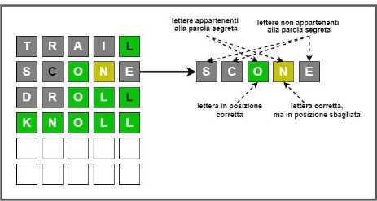

<html><head><meta http-equiv="Content-Type" content="text/html; charset=utf-8" /><meta http-equiv="Content-Style-Type" content="text/css" /><meta name="generator" content="Aspose.Words for .NET 23.6.0" /><title></title></head><body>

&#xa0;&#xa0;&#xa0;&#xa0;&#xa0;&#xa0;&#xa0;&#xa0;&#xa0;&#xa0;&#xa0;&#xa0;&#xa0;&#xa0; WORDLE: un gioco di parole 3.0&#xa0;&#xa0;&#xa0; 
<ol type="1" style="margin:0pt; padding-left:0pt"><li style="margin-top:24.95pt; margin-left:15.63pt; text-align:justify; line-height:17.1pt; padding-left:20.37pt; font-family:Calibri; font-size:14pt">Descrizione del gioco</li></ol>
Il progetto consiste nella implementazione di WORDLE, un gioco di parole web-based, divenuto virale alla fine del 2021. In questa sezione descriveremo le regole generali del gioco, in quella successiva le specifiche della versione di WORDLE da implementare. 

Il gioco consiste nel trovare una parola inglese formata da 5 lettere, impiegando un numero massimo&#xa0; di 6 tentativi. WORDLE dispone di un vocabolario di parole di 5 lettere, da cui estrae casualmente una parola SW (Secret Word), che gli utenti devono indovinare. Ogni giorno viene selezionata una nuova SW, che rimane invariata fino al giorno successivo e che viene proposta a&#xa0; tutti gli utenti che si collegano al sistema durante quel giorno. Quindi esiste una sola parola per ogni giorno e tutti gli utenti devono indovinarla, questo attribuisce al gioco un aspetto sociale. L’utente propone una parola GW (Guessed Word) e il sistema inizialmente verifica se la parola è presente nel vocabolario. In caso negativo avverte l’utente che deve immettere un’altra parola. In caso la parola sia presente, il sistema 

fornisce all’utente tre tipi d'indizi,&#xa0; per ogni lettera l di GW, il sistema indica: 

●&#xa0;&#xa0;&#xa0;&#xa0;&#xa0;&#xa0;&#xa0; se l è stata indovinata e si trova nella posizione corretta rispetto a SW 

●&#xa0;&#xa0;&#xa0;&#xa0;&#xa0;&#xa0;&#xa0; se l è stata indovinata, ma si trova in una posizione diversa in SW 

●&#xa0;&#xa0;&#xa0;&#xa0;&#xa0;&#xa0;&#xa0; se l non compare in SW 

In WORDLE, questi indizi vengono presentati all’utente colorando le lettere in GW con colori diversi,&#xa0; come mostrato in Fig.1 

Fig.1 Uno scenario&#xa0; di gioco 

L’utente, utilizzando questi indizi, immette un’altra parola. Il gioco termina se l’utente individua la parola segreta oppure se i tentativi sono terminati. Il sistema memorizza, per ogni utente, le seguenti statistiche e le mostra a termine di ogni gioco: 

●&#xa0;&#xa0;&#xa0;&#xa0;&#xa0;&#xa0;&#xa0; numero partite giocate 

●&#xa0;&#xa0;&#xa0;&#xa0;&#xa0;&#xa0;&#xa0; percentuale di partite vinte 

●&#xa0;&#xa0;&#xa0;&#xa0;&#xa0;&#xa0;&#xa0; lunghezza dell’ultima sequenza continua (streak) di vincite 

●&#xa0;&#xa0;&#xa0;&#xa0;&#xa0;&#xa0;&#xa0; lunghezza della massima sequenza continua (streak) di vincite 

●&#xa0;&#xa0;&#xa0;&#xa0;&#xa0;&#xa0;&#xa0; guess distribution: la distribuzione di tentativi impiegati per arrivare alla soluzione del gioco, in ogni partita vinta dal giocatore. 

Infine, per incrementare l’aspetto social del gioco,&#xa0; WORDLE fornisce all’utente, a fine di ogni gioco, la possibilità di condividere i tentativi effettuati (sia che il gioco sia terminato con successo o meno), sulle più importanti social network. Per evitare spoiler, vengono condivisi solo i colori delle lettere proposte in ogni tentativo. Ad esempio, per l’esempio riportato in Fig.1, le informazioni che l’utente può condividere&#xa0;&#xa0; sono mostrate&#xa0; in&#xa0; Fig.2.&#xa0; Nell’intestazione&#xa0; è&#xa0; presente&#xa0; il&#xa0; numero del&#xa0; gioco&#xa0; (le&#xa0; parole proposte da WORDLE sono numerate progressivamente) e il numero di tentativi prima della fine del gioco. 

Fig.2: condivisione dei risultati 
<ol start="2" type="1" style="margin:0pt; padding-left:0pt"><li style="margin-top:26.6pt; margin-left:13.85pt; text-align:justify; line-height:17.1pt; font-family:Calibri; font-size:14pt">Funzionalità</li></ol>
Si richiede d'implementare una versione semplificata di WORDLE, che&#xa0; conservi però&#xa0; la logica di base del gioco. In particolare, la fase di condivisione dei risultati non richiederà l’interazione con una social network, ma sarà realizzata mediante la definizione e l’uso di un gruppo multicast a cui partecipano tutti i giocatori registrati al gioco.&#xa0; Inoltre&#xa0; l’implementazione richiesta utilizzerà un vocabolario di parole di 10 lettere (che verrà fornito) e un numero di tentativi massimo pari a 12. 

Distingueremo &#xa0;in &#xa0;seguito &#xa0;l’insieme &#xa0;di &#xa0;funzionalità &#xa0;di &#xa0;base &#xa0;da &#xa0;quelle &#xa0;aggiuntive. &#xa0;L’insieme &#xa0;di funzionalità di base dovranno essere implementate sia dagli studenti del vecchio ordinamento che da quelli del nuovo ordinamento, quelle aggiuntive solo dagli studenti del vecchio ordinamento. Inoltre l’implementazione di alcune funzionalità di base sarà diversa per gli studenti del nuovo rispetto a quelli del vecchio ordinamento, come specificato nella sezione 2.1 e 2.2. 

2.1&#xa0; Funzionalità di base (per gli studenti di entrambe gli ordinamenti)

Il gioco deve essere implementato mediante due componenti principali, che interagiscono usando diversi protocolli e paradigmi di comunicazione di rete. Le componenti sono le seguenti: 

●&#xa0;&#xa0;&#xa0;&#xa0;&#xa0;&#xa0;&#xa0; WordleClient. Gestisce l’interazione con l’utente, tramite una CLI (Command Line Interface) (l’interfaccia grafica è opzionale), comunica con il WordleServer per eseguire le azioni richieste dall’utente. Le principali operazioni&#xa0; sono le seguenti; 
<ul type="circle" style="margin:0pt; padding-left:0pt"><li style="margin-top:0.05pt; margin-left:65.6pt; text-align:justify; line-height:13.4pt; padding-left:6.4pt; font-family:serif; font-size:11pt; -aw-font-family:'Courier New'; -aw-font-weight:normal; -aw-number-format:'o'">register(username, &#xa0;password): &#xa0;registrazione &#xa0;a &#xa0;WORDLE. &#xa0;L’utente &#xa0;deve &#xa0;fornire username &#xa0;e &#xa0;una &#xa0;password. &#xa0;Il &#xa0;server &#xa0;risponde &#xa0;con &#xa0;un &#xa0;codice &#xa0;che &#xa0;può &#xa0;indicare l’avvenuta registrazione, oppure, se lo username è già presente, o se la password è vuota, &#xa0;restituisce &#xa0;un &#xa0;messaggio &#xa0;d’errore. &#xa0;Lo &#xa0;username &#xa0;dell’utente &#xa0;deve &#xa0;essere univoco.&#xa0; Come&#xa0; specificato&#xa0; in&#xa0; seguito,&#xa0; le&#xa0; registrazioni&#xa0; sono&#xa0; tra&#xa0; le&#xa0; informazioni&#xa0; da persistere lato server. </li></ul><ul type="circle" style="margin:0pt; padding-left:0pt"><li style="margin-top:15.95pt; margin-left:65.6pt; text-align:justify; line-height:13.45pt; padding-left:6.4pt; font-family:serif; font-size:11pt; -aw-font-family:'Courier New'; -aw-font-weight:normal; -aw-number-format:'o'">login(username, password): login di un utente già registrato per accedere al servizio. Il server risponde con un codice che può indicare l’avvenuto login, oppure, se l’utente ha già effettuato la login o la password è errata, restituisce un messaggio d’errore. </li><li style="margin-left:65.6pt; text-align:justify; line-height:13.45pt; padding-left:6.4pt; font-family:serif; font-size:11pt; -aw-font-family:'Courier New'; -aw-font-weight:normal; -aw-number-format:'o'">logout(username): effettua il logout dell’utente dal servizio. </li><li style="margin-top:0.05pt; margin-left:65.6pt; text-align:justify; line-height:13.3pt; padding-left:6.4pt; font-family:serif; font-size:11pt; -aw-font-family:'Courier New'; -aw-font-weight:normal; -aw-number-format:'o'">playWORDLE(): &#xa0;richiesta d'iniziare il gioco indovinando l’ultima parola estratta dal server. Il server controlla se l’utente ha già partecipato al gioco per quella parola, nel qual caso&#xa0; invia&#xa0; un messaggio di errore, altrimenti il server invia un messaggio in cui indica al client che può iniziare l’invio delle Guessed Word.&#xa0; &#xa0;</li><li style="margin-left:65.6pt; text-align:justify; line-height:13.4pt; padding-left:6.4pt; font-family:serif; font-size:11pt; -aw-font-family:'Courier New'; -aw-font-weight:normal; -aw-number-format:'o'">sendWord(): invio da parte del client di una Guessed Word al server. Il server risponde indicando se la parola è presente nel vocabolario e, in questo caso, fornendo gli indizi. Se la parola non è presente, viene inviato un codice particolare, però il tentativo non viene contato tra i 12 tentativi consentiti. </li><li style="margin-top:0.05pt; margin-left:65.6pt; line-height:14.5pt; padding-left:6.4pt; font-family:serif; font-size:11pt; -aw-font-family:'Courier New'; -aw-font-weight:normal; -aw-number-format:'o'">sendMeStatistics():&#xa0; richiesta&#xa0; delle&#xa0; statistiche&#xa0; dell’utente&#xa0; aggiornata&#xa0; dopo&#xa0; l’ultimo gioco </li><li style="margin-left:65.6pt; text-align:justify; line-height:14.5pt; padding-left:6.4pt; font-family:serif; font-size:11pt; -aw-font-family:'Courier New'; -aw-font-weight:normal; -aw-number-format:'o'">share()&#xa0; richiesta&#xa0;&#xa0; di&#xa0; condividere&#xa0; i&#xa0; risultati&#xa0; del&#xa0; gioco&#xa0; su&#xa0; un&#xa0; gruppo&#xa0; sociale.&#xa0; Come descritto nella sezione 3, il gruppo sociale verrà implementato come un gruppo di multicast </li><li style="margin-top:0.15pt; margin-left:65.6pt; line-height:14.35pt; padding-left:6.4pt; font-family:serif; font-size:11pt; -aw-font-family:'Courier New'; -aw-font-weight:normal; -aw-number-format:'o'">showMeSharing(): mostra sulla CLI le notifiche inviate dal server riguardo alle partite degli altri utenti. </li></ul>
●&#xa0;&#xa0;&#xa0;&#xa0;&#xa0;&#xa0;&#xa0; WordleServer. Gestisce la fase di registrazione e di login degli utenti, memorizza tutti gli utenti registrati, propone periodicamente una nuova parola, interagisce con i diversi client che vogliono partecipare al gioco fornendo gli indizi per la ricerca della parola segreta, gestisce le statistiche degli utenti, provvede, su richiesta dell’utente, a inviare a tutti gli utenti iscritti al gruppo di condivisione, le informazioni relative alla partita conclusa da un utente. 

2.2&#xa0; Funzionalità aggiuntive (per gli studenti del vecchio ordinamento)

Gli studenti del vecchio ordinamento dovranno implementare anche le seguenti funzionalità 

●&#xa0;&#xa0;&#xa0;&#xa0;&#xa0;&#xa0;&#xa0; WordleServer. Il server deve 
<ul type="circle" style="margin:0pt; padding-left:0pt"><li style="margin-left:65.6pt; text-align:justify; line-height:14.5pt; padding-left:6.4pt; font-family:serif; font-size:11pt; -aw-font-family:'Courier New'; -aw-font-weight:normal; -aw-number-format:'o'">Mantenere una classifica ordinata degli utenti. Il punteggio attribuito a ogni utente è calcolato in funzione del numero di parole indovinate e del numero di tentativi prima della conclusione vittoriosa del gioco. Il calcolo del punteggio per l’inserimento in classifica avviene moltiplicando il numero di partite vinte per il numero medio di tentativi impiegati per raggiungere la soluzione. </li><li style="margin-left:65.6pt; text-align:justify; line-height:14.5pt; padding-left:6.4pt; font-family:serif; font-size:11pt; -aw-font-family:'Courier New'; -aw-font-weight:normal; -aw-number-format:'o'">Quando l’utente termina una sessione di gioco, con successo o con fallimento, deve fornire al client la traduzione italiana della parola segreta, ottenuta accedendo al servizio presente alla URL </li></ul>
https://mymemory.translated.net/doc/spec.php,&#xa0; tramite una chiamata HTTP GET. 

●&#xa0;&#xa0;&#xa0;&#xa0;&#xa0;&#xa0;&#xa0; WordleClient. il client deve 
<ul type="circle" style="margin:0pt; padding-left:0pt"><li style="margin-top:0.05pt; margin-left:65.6pt; text-align:justify; line-height:14.5pt; padding-left:6.4pt; font-family:serif; font-size:11pt; -aw-font-family:'Courier New'; -aw-font-weight:normal; -aw-number-format:'o'">Essere&#xa0; avvertito&#xa0; ogni&#xa0; volta&#xa0; c’è&#xa0; un&#xa0; aggiornamento&#xa0; nelle&#xa0; prime&#xa0; tre&#xa0; posizioni&#xa0; della classifica. La classifica viene visualizzata on demand sul client mediante il messaggio showMeRanking() </li></ul><ol start="3" type="1" style="margin:0pt; padding-left:0pt"><li style="margin-top:31.85pt; margin-left:13.85pt; text-align:justify; line-height:17.1pt; font-family:Calibri; font-size:14pt">Specifiche per l’implementazione</li></ol>
Nella realizzazione del progetto devono essere utilizzate molte delle tecnologie illustrate durante il 

corso. In particolare: 

●&#xa0;&#xa0;&#xa0;&#xa0;&#xa0;&#xa0;&#xa0; L'utente interagisce con WORDLE mediante un client che utilizza un'interfaccia a linea di comando. E’ facoltativa l’implementazione di un'interfaccia grafica. 

●&#xa0;&#xa0;&#xa0;&#xa0;&#xa0;&#xa0;&#xa0; Fase di registrazione 

○&#xa0;&#xa0;&#xa0;&#xa0;&#xa0;&#xa0;&#xa0; (studenti nuovo ordinamento): questa fase viene implementata instaurando&#xa0; una connessione TCP con il server 

○&#xa0;&#xa0;&#xa0;&#xa0;&#xa0;&#xa0;&#xa0; (studenti vecchio ordinamento) questa fase&#xa0; viene implementata mediante RMI 

●&#xa0;&#xa0;&#xa0;&#xa0;&#xa0;&#xa0;&#xa0; Fase di login: deve essere effettuata come prima operazione,&#xa0; dopo che è stata effettuata la registrazione. In ogni sessione di login, ogni utente può tentare d'indovinare più SW, a seconda della durata della session. Ogni tentativo d'indovinare una parola si intende concluso se l’utente esegue il logout. 

○&#xa0;&#xa0;&#xa0;&#xa0;&#xa0;&#xa0;&#xa0; (solo studenti vecchio ordinamento) In seguito alla login il client si registra a un servizio di notifica del server per ricevere aggiornamenti sulla classifica degli utenti. Il servizio di notifica deve essere implementato con il meccanismo di RMI&#xa0; callback. Il client mantiene una struttura dati per tenere traccia delle modifiche avvenute nelle prime posizioni della classifica utenti, che è aggiornata in seguito alla ricezione della callback. 

●&#xa0;&#xa0;&#xa0;&#xa0;&#xa0;&#xa0;&#xa0; Dopo previa login effettuata con successo, l’utente interagisce, secondo il modello client- server (richieste/risposte), con il server sulla connessione TCP persistente creata, inviando uno dei&#xa0; comandi&#xa0; elencati&#xa0; nella&#xa0; sezione&#xa0; 2.1.&#xa0; Tutte&#xa0; le&#xa0; operazioni&#xa0; sono&#xa0; effettuate&#xa0; su&#xa0; questa connessione TCP 

●&#xa0;&#xa0;&#xa0;&#xa0;&#xa0;&#xa0;&#xa0; Ogni client, dopo la fase di login, si unisce a un gruppo di multicast di cui fa parte anche il server. La condivisione dell’esito di una partita, richiesta dal client mediante il&#xa0; comando share(), viene inviata dal server ai client mediante un messaggio UDP su questo gruppo di multicast.&#xa0; Il client deve essere sempre in attesa di questi messaggi di notifica da parte del server&#xa0; e deve memorizzare le notifiche in una sua struttura dati. 

●&#xa0;&#xa0;&#xa0;&#xa0;&#xa0;&#xa0;&#xa0; Il server può essere realizzato con JAVA I/O e threadpool oppure può effettuare il multiplexing dei canali mediante NIO (eventualmente con threadpool per la gestione delle richieste). Il server definisce opportune strutture dati per memorizzare le informazioni relative agli utenti e persiste lo stato del sistema. Quando il server viene riavviato tali informazioni sono utilizzate per&#xa0; ricostruire&#xa0; lo&#xa0; stato&#xa0; del&#xa0; sistema.&#xa0; Le&#xa0; informazioni&#xa0; devono&#xa0; essere&#xa0; memorizzate&#xa0; su&#xa0; file utilizzando il formato JSON. 

●&#xa0;&#xa0;&#xa0;&#xa0;&#xa0;&#xa0;&#xa0; Il periodo di tempo che intercorre tra la pubblicazione di una parola e la pubblicazione della parola successiva è definito come parametro di configurazione. Si ricorda che un utente può partecipare a più giochi (secret words) durante la stessa sessione di login, ma una volta che ha tentato d'indovinare una secret word (con esito positivo o negativo), deve attendere l’estrazione della successiva secret word per giocare di nuovo. 

●&#xa0;&#xa0;&#xa0;&#xa0;&#xa0;&#xa0;&#xa0; La visualizzazione dei suggerimenti del server sulla CLI può essere effettuata associando a ogni colore diverso una diversa lettera (esempio grigio:’X’, verde: ‘+’, giallo: ‘?’, si ricorda che il significato dei colori è quello mostrato in Fig.1 e Fig.2) 
<ol start="4" type="1" style="margin:0pt; padding-left:0pt"><li style="margin-top:15.6pt; margin-left:13.85pt; text-align:justify; line-height:17.1pt; font-family:Calibri; font-size:14pt">Modalità di svolgimento e di consegna del progetto</li></ol>
Il progetto deve essere eseguito individualmente. 

Il materiale da consegnare comprende: 

●&#xa0;&#xa0;&#xa0;&#xa0;&#xa0;&#xa0;&#xa0; Il codice dell'applicazione e di eventuali programmi utilizzati per il test delle sue funzionalità. 

●&#xa0;&#xa0;&#xa0;&#xa0;&#xa0;&#xa0;&#xa0; la relazione in formato pdf. 

Per quanto riguarda il codice, si tenga presente che: 

●&#xa0;&#xa0;&#xa0;&#xa0;&#xa0;&#xa0;&#xa0; deve&#xa0; compilare&#xa0; correttamente&#xa0; da&#xa0; riga&#xa0; di&#xa0; comando&#xa0; (ovvero&#xa0; invocando&#xa0; direttamente&#xa0; il compilatore javac). In caso contrario, il progetto non verrà considerato valido. 

●&#xa0;&#xa0;&#xa0;&#xa0;&#xa0;&#xa0;&#xa0; deve essere ben commentato. 

●&#xa0;&#xa0;&#xa0;&#xa0;&#xa0;&#xa0;&#xa0; le&#xa0; classi&#xa0; che&#xa0; contengono&#xa0; un&#xa0; metodo&#xa0; main&#xa0; devono&#xa0; contenere&#xa0; “main”&#xa0; nel&#xa0; nome,&#xa0; es. ServerMain.java; per le altre classi non ci sono vincoli, ma nomi mnemonici sono ovviamente apprezzati. 

●&#xa0;&#xa0;&#xa0;&#xa0;&#xa0;&#xa0;&#xa0; oltre al codice sorgente, è necessario consegnare un file JAR eseguibile per ogni applicazione (es. un file JAR per il client e uno per il server). 

●&#xa0;&#xa0;&#xa0;&#xa0;&#xa0;&#xa0;&#xa0; i parametri di input delle applicazioni (numeri di porta, indirizzi, valori di timeout, ecc.) devono essere letti automaticamente da appositi file di configurazione testuali da consegnare assieme al resto del codice (due file separati per client e server). Non è consentito leggere i parametri in modo "interattivo" (ovvero facendo in modo che sia il programma a chiederli dopo essere stato avviato). 

●&#xa0;&#xa0;&#xa0;&#xa0;&#xa0;&#xa0;&#xa0; in caso di progetti realizzati con Eclipse, IntelliJ IDEA o altri IDE, è obbligatorio consegnare solamente il codice sorgente, rimuovendo eventuali altri file (o directory) creati dall’IDE per gestire il progetto. 

●&#xa0;&#xa0;&#xa0;&#xa0;&#xa0;&#xa0;&#xa0; eventuali librerie esterne utilizzate (jar) vanno allegate al progetto. 

Per quanto riguarda la relazione, essa deve essere consegnata in formato pdf e deve contenere: 

●&#xa0;&#xa0;&#xa0;&#xa0;&#xa0;&#xa0;&#xa0; la&#xa0; definizione&#xa0; delle&#xa0; scelte&#xa0; effettuate&#xa0; nei&#xa0; punti&#xa0; del&#xa0; progetto&#xa0; lasciati&#xa0; alla&#xa0; personale interpretazione 

●&#xa0;&#xa0;&#xa0;&#xa0;&#xa0;&#xa0;&#xa0; una definizione delle strutture dati utilizzate sia lato server che lato client 

●&#xa0;&#xa0;&#xa0;&#xa0;&#xa0;&#xa0;&#xa0; uno schema generale dei thread attivati sia lato server che lato client 

●&#xa0;&#xa0;&#xa0;&#xa0;&#xa0;&#xa0;&#xa0; una descrizione delle eventuali primitive di sincronizzazione utilizzate dai therad per accedere a&#xa0; strutture dati condivise 

●&#xa0;&#xa0;&#xa0;&#xa0;&#xa0;&#xa0;&#xa0; una sezione d'istruzioni su come compilare ed eseguire il progetto (librerie esterne usate, argomenti da passare al codice, sintassi dei comandi per eseguire le varie operazioni...). Questa sezione deve essere un manuale d'istruzioni semplice e chiaro per gli utilizzatori del sistema. 

●&#xa0;&#xa0;&#xa0;&#xa0;&#xa0;&#xa0;&#xa0; l'organizzazione e la chiarezza della relazione influiranno sul voto finale. 

Relazione e codice sorgente devono essere consegnati su Moodle in un unico archivio compresso in formato zip. 

</body></html>
